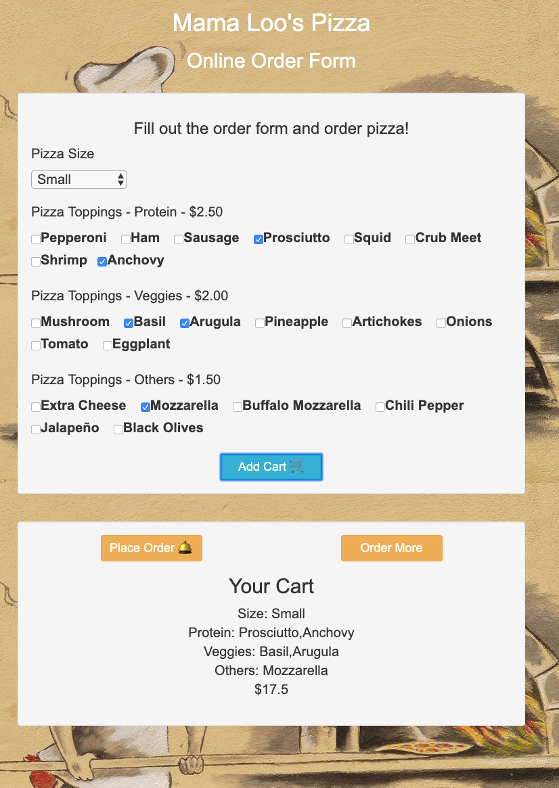

# Pizza Order

#### _Intermediate JavaScript - week 1 solo project: a Pizza Order application, 8/30/2019_

## Description
Build a Pizza Order application (using HTML, CSS, JavaScript and jQuery)

Create a website for a pizza company where a user can choose one or more individual toppings (cheese, pepperoni, artichoke, anchovy, etc) and a size to order a pizza and see the final cost.

![screenshot of order]
## Website should have:
- Allow the user to choose toppings and size for the pizza they'd like to order.
- Create a pizza object constructor with properties for toppings and size.

    There is a constructor: Order
- Create a prototype method for the cost of a pizza depending on the selections chosen. Use your own formula for this.
    
    There are three prototype: 
    - sizePrice()
    - toppingPrice()
    - totalPrice()

### Specs

Here is the individual behaviors with input/output examples.

## Setup/Installation Requirements

* Clone this repo:

`$git clone https://github.com/misakimichy/pizza-order.git`

* Navigate to the top level of the cloned directory.
* Then, open your preferred web browser.

## Known Bugs
* There are no know bugs at this time.

## Support and contact details
 misaki.koonce@gmail.com

## Technologies Used
_Git GitHub  HTML CSS Bootstrap jQuery JavaScript and VSCode 

## License
Copyright © 2019 under the MIT License